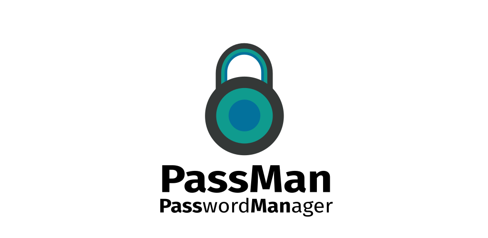

# PassMan 

### A simple, cross-platform password manager created with Flutter.
 

 

---
### How to run this
- Install Flutter for your platform of choice from [here](https://flutter.dev/docs/get-started/install).
- This project uses [Moor](https://pub.dev/packages/moor) for persistent storage and as such supports [all platforms that Moor does](https://moor.simonbinder.eu/docs/platforms/). As mentioned in the supported platforms page for it, for desktop support most Linux distrubutions include a SQLite binary and MacOS will utilize the `VmDatabase` class (A Moor database that runs in a Dart VM), so no extra steps for it. For Windows or a Linux distribution without SQLite, you need to [download](https://sqlite.org/download.html) and install SQLite. Note: I might ship a pre-compiled SQLite binary for individual platform packages when I release version 1.0.0 executables for desktop.
- For desktop development, also make sure to follow the requirements [here](https://flutter.dev/desktop).
- Clone the repository. After it is cloned `cd` into the repository directory and run `flutter run --release`. This will launch the application in release mode, if you want to utilize hot-reloading and hot-restarting for any reason, omit the `--release` flag.